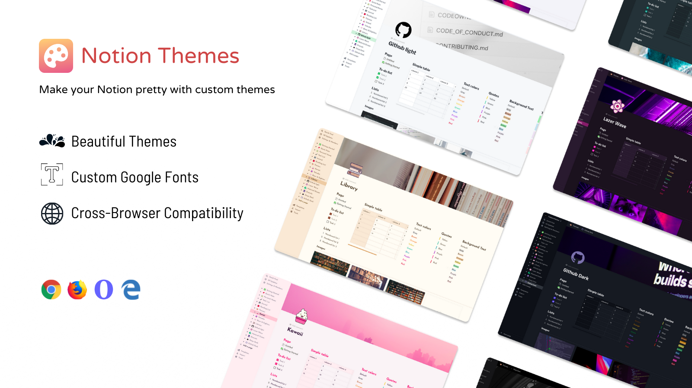

<h1 align="center">Notion Themes</h1>

Make your Notion pretty with custom themes

 

## ⚙️ Installation Instructions

### 1. Download and install the extension

**Google Chrome / Microsoft Edge / Opera**

1. Download this repo as a [ZIP file](https://github.com/notionblog/NotionThemes/releases/download/0.0.2/chrome.zip).
1. Unzip the file and you should have a folder named `chrome`.
1. In Chrome/Edge go to the extensions page (`chrome://extensions` or `edge://extensions` or `opera:extensions`).
1. Enable Developer Mode.
1. Drag the `chrome` folder anywhere on the page to import it (do not delete the folder afterwards).

**Mozilla Firefox**

1. Download this file [firefox.xpi](https://github.com/notionblog/NotionThemes/releases/download/0.0.2/firefox.xpi)
2. In Firefox go to the addons page `about:addons` or click `CMD+SHIFT+A`
3. drag and drop the file on the page or click `install Add-on From file ...`

### 2. Guide

1. Pin the extension in your browser
2. Open it and click `Choose a theme` blue button
3. You'll be redirected to options page where you can select a theme
4. Refresh your Notion page
5. Enjoy!!

## 📝 Note

- Dark themes will work only if you switched to the dark Mode in Notion

## ✨ Feedback

All bugs, feature requests, pull requests, feedback, etc., are welcome. [Create an issue](https://github.com/notionblog/NotionThemes/issues).

## 💖 Donate

If you’d like to support my work and efforts, your donations mean a lot <3

